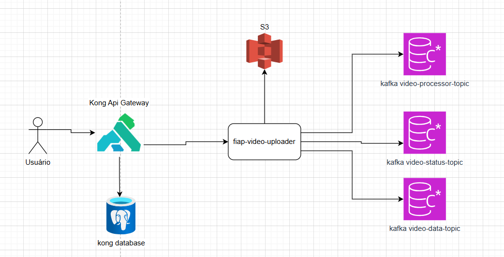

# 🎬 FIAP Video Uploader

Aplicação responsável por receber chamadas redirecionadas do **Kong** e enviar vídeos para processamento no **S3**.  
Após o upload, publica mensagens nos tópicos Kafka:

- `video-status`: para indicar mudanças no status do vídeo;
- `video-data`: para atualizar informações do vídeo no banco de dados;
- `video-processor`: para disparar o processamento do vídeo por outras aplicações.

---

## 📸 Funcionamento

O fluxo geral é:

1. Usuário envia o vídeo via API (redirecionada pelo Kong).
2. Aplicação faz upload do vídeo no S3.
3. Publica mensagens nos tópicos Kafka relevantes.
4. Outras aplicações consomem os tópicos e realizam ações (notificação, processamento, atualização de dados).

---

## ⚙️ Tecnologias Utilizadas

- **Java 21**
- **Spring Boot**
- **Kafka**
- **Docker**
- **S3** (armazenamento de vídeos)

---